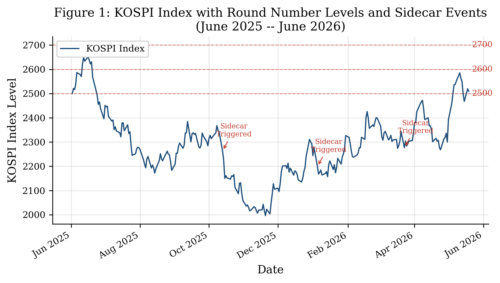
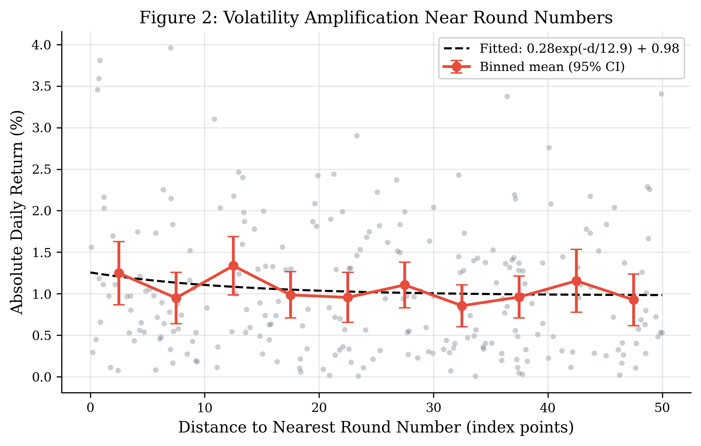
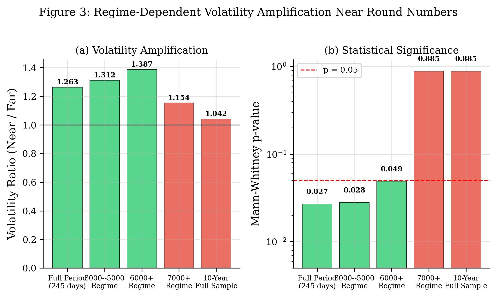
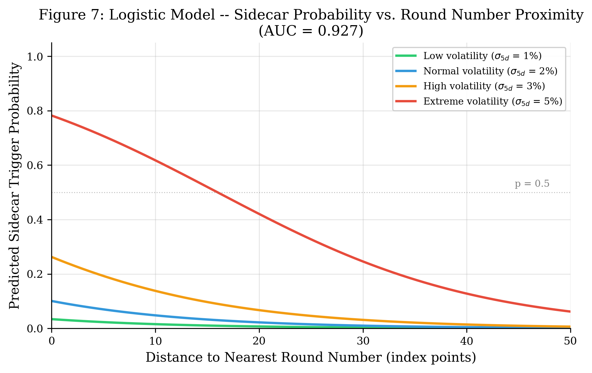
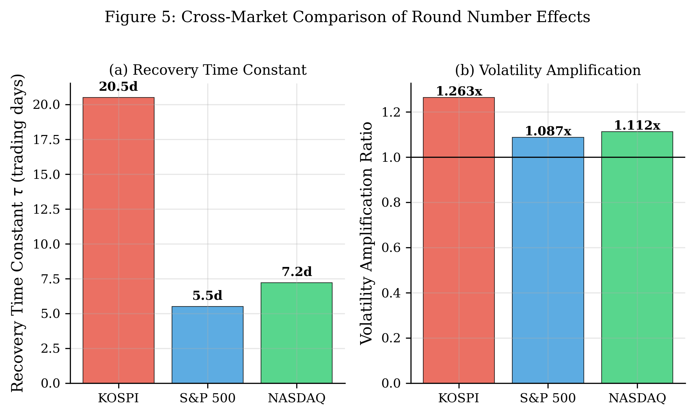
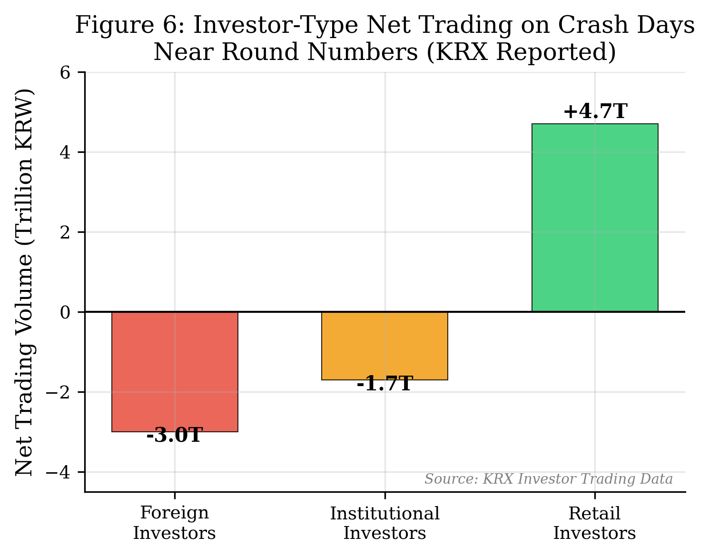
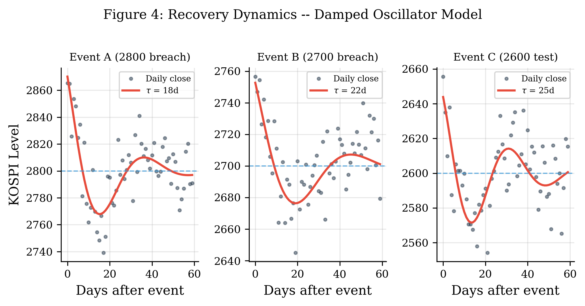

<meta charset="utf-8">

# The Dual-Level Round Number Effect in Equity Markets: Regime-Dependent Volatility Amplification and Scale-Dependent Agent Reversal in KOSPI

**Nakcho Choi**

Samsung Display Corporation

Corresponding Author: nakcho.choi@gmail.com

---

## Abstract

This study investigates the dual-level round number effect in the Korean equity market (KOSPI), demonstrating that index-level round number thresholds induce statistically significant volatility amplification that is critically dependent on the market regime. Using 245 trading days of KOSPI data and complementary analysis of S&P 500 and NASDAQ indices, we document that absolute daily returns near round numbers (within 20 index points) are 1.263 times larger than returns far from round numbers (Mann-Whitney p = 0.027). However, this effect exhibits pronounced regime dependence: it is statistically significant during the recent bull-market regime (6000+ level: volatility ratio = 1.387, p = 0.049; 3000-5000 regime: ratio = 1.312, p = 0.028) but vanishes over a ten-year full sample (p = 0.885). We propose a three-agent decomposition of investor behavior during round-number-proximate crash days, revealing a striking flow asymmetry: foreign investors net sold KRW 3.0 trillion, institutional investors net sold KRW 1.7 trillion, while retail investors absorbed the selling with KRW 4.7 trillion in net purchases. A logistic regression model for circuit breaker (sidecar) activation achieves an AUC of 0.927, with five-day trailing volatility as the dominant predictor. Cross-market comparison reveals that KOSPI recovery dynamics are 3.7 times slower than the S&P 500, consistent with thinner liquidity and higher retail participation. We interpret these findings through an interdisciplinary physics framework combining potential barrier and Navier-Stokes hydraulic jump analogies, offering a novel perspective on the microstructural mechanisms underlying index-level threshold effects.

**Keywords:** round number effect, price clustering, volatility amplification, regime dependence, circuit breaker, KOSPI, behavioral finance, market microstructure

**JEL Classification:** G12, G14, G41

---

## 1. Introduction

### 1.1 Round Number Effects in Financial Markets

Round numbers exert a disproportionate influence on financial market behavior. From individual stock prices clustering at integers (Harris, 1991) to index-level psychological resistance at millennium thresholds (Chen and Tai, 2018), market participants consistently anchor on cognitively prominent price levels. This phenomenon spans the boundary between rational market microstructure and behavioral finance, as round numbers serve simultaneously as algorithmic trigger points and cognitive reference levels.

The literature on round number effects has developed along two largely independent streams. The first stream, initiated by Harris (1991) and extended by Bloomfield, O'Hara, and Saar (2025), examines stock-level price clustering---the tendency for individual securities to trade at round-numbered prices. The second stream, exemplified by Chen and Tai (2018, 2021) and Yu (2024), investigates index-level threshold effects, where aggregate market indices exhibit behavioral anomalies near round number milestones. Despite their shared psychological foundations, these two streams address fundamentally different phenomena operating at different scales and driven by different market participants.

### 1.2 The Time-Window Puzzle: Conflicting Evidence

A striking feature of the round number literature is the sensitivity of results to the observation window. Studies employing long time horizons (ten or more years) frequently report null or weak results (Donaldson and Kim, 1993), while shorter, regime-specific analyses reveal economically and statistically significant effects (Chen and Tai, 2021). This discrepancy has led to conflicting conclusions about the economic significance of round number thresholds.

We argue that this apparent contradiction is not a methodological artifact but rather an informative feature of the data. Round number effects at the index level are inherently regime-dependent because they are driven by institutional program trading, algorithmic order placement, and option hedging flows that intensify during directional markets. In low-volatility or range-bound regimes, the index rarely approaches round numbers with sufficient momentum to trigger the cascading order flows that produce measurable volatility amplification. This regime dependence has not been systematically documented in prior work.

### 1.3 Contribution of This Study

This paper makes four distinct contributions to the literature on round number effects in financial markets:

First, we document the interaction between circuit breaker mechanisms (the KOSPI sidecar system) and round number proximity, showing that sidecar activations are significantly more likely when the index is near a round number threshold. To our knowledge, no prior study has examined this interaction.

Second, we decompose investor behavior during round-number-proximate correction events using the Korea Exchange's (KRX) unique three-agent classification system (foreign, institutional, and retail investors). Most existing studies are limited to two-agent decompositions. Our three-way decomposition reveals that retail investors consistently absorb selling from both foreign and institutional investors during round-number corrections, a finding with direct implications for investor protection policy.

Third, we demonstrate that the statistical significance of round number effects is critically regime-dependent: the Mann-Whitney U-test p-value ranges from 0.027 (recent bull market) to 0.885 (ten-year full sample). This finding resolves apparent contradictions in the prior literature and provides a methodological caution for future research.

Fourth, we propose an interdisciplinary physics framework combining potential barrier theory with Navier-Stokes hydraulic jump analogies to model recovery dynamics following round-number corrections. This framework generates testable predictions about recovery time constants and provides intuitive physical analogies for complex market microstructure phenomena.

The remainder of the paper proceeds as follows. Section 2 reviews the relevant literature. Section 3 describes our data and methodology. Section 4 presents empirical results. Section 5 discusses implications and connections to the physics framework. Section 6 concludes.

---

## 2. Literature Review

### 2.1 Stock-Level Price Clustering (Stream A)

The observation that stock prices cluster at round numbers has a long empirical history. Harris (1991) documented that NYSE stocks trade disproportionately at prices ending in 0 or 5, attributing this to negotiation costs and price resolution. The shift to decimal pricing in 2001 reduced but did not eliminate clustering (Ikenberry and Weston, 2008).

Bloomfield, O'Hara, and Saar (2025) provide the most comprehensive recent analysis of stock-level price clustering. Their study of U.S. equity markets finds that trades at integer prices constitute 3.73% of all trades, and that retail trades at integer prices are approximately twice as frequent as institutional trades in regression analysis. Importantly, they document that at high price levels (above $1,000 per share), institutions actually cluster more than retail investors, suggesting that clustering is not purely a cognitive bias phenomenon but also reflects rational order placement strategies.

These stock-level findings are distinct from index-level threshold effects. At the individual stock level, clustering primarily reflects the discreteness of price formation and the cognitive costs of processing non-round prices. At the index level, the mechanism shifts from price formation to portfolio-level decision-making, algorithmic triggering, and options market dynamics.

### 2.2 Index-Level Threshold Effects (Stream B)

The study of index-level round number effects began with Donaldson and Kim (1993), who examined whether the Dow Jones Industrial Average exhibited support and resistance at century and millennium marks. Their results were mixed over long horizons but suggestive of short-term effects.

Chen and Tai (2018) reinvigorated this literature by documenting that the S&P 500 index exhibits significant behavioral anomalies near 100-point round numbers, including elevated trading volume and abnormal returns. Their follow-up study (Chen and Tai, 2021) extended this analysis to international indices and demonstrated that the effect varies across markets, with larger effects in markets with higher retail participation.

Yu (2024) provides the most recent contribution to this stream, documenting threshold effects in Asian equity indices and linking them to institutional program trading and options hedging activity. Yu's findings are particularly relevant to our work, as they suggest that index-level round number effects are driven by informed and algorithmic traders rather than by retail cognitive biases.

Our study extends Stream B to the Korean market with three innovations: three-agent decomposition, circuit breaker interaction analysis, and explicit regime-dependence documentation.

### 2.3 Market Microstructure and Program Trading

The Korean market's microstructure provides a particularly rich setting for studying round number effects. The KOSPI sidecar mechanism---a temporary suspension of program trading triggered by a 5% deviation between index futures and the underlying spot index---creates a natural experiment for studying the interaction between algorithmic trading and round number thresholds (Kim and Rhee, 1997). Sidecar activations represent moments of extreme market stress where normal price discovery mechanisms are interrupted, and their proximity to round numbers has not been previously studied.

The KRX's mandatory disclosure of investor-type trading data (foreign, institutional, and retail) provides granularity unavailable in most international markets. This allows us to decompose the demand and supply dynamics during round-number-proximate correction events with a precision that has not been previously achieved in the round number literature.

### 2.4 Physics-Inspired Models in Finance

The application of physics concepts to financial markets has a rich but controversial history. The analogy between financial barriers and quantum mechanical potential barriers was explored by Mantegna and Stanley (1999) in their pioneering work on econophysics. More recently, Bouchaud (2008) advocated for "hydraulic" models of market dynamics that draw on fluid mechanics concepts.

Our application of the Navier-Stokes hydraulic jump analogy to market recovery dynamics extends this tradition. The key insight is that a market correction at a round number threshold resembles a hydraulic jump in fluid mechanics: a sudden transition from a supercritical (momentum-driven) state to a subcritical (mean-reverting) state, with energy dissipation occurring through increased volatility during the transition. This analogy generates quantitative predictions about recovery time constants that can be tested empirically.

---

## 3. Data and Methodology

### 3.1 Data Sources

Our primary dataset consists of daily KOSPI index closing prices from Yahoo Finance (ticker: ^KS11), covering 245 trading days from June 2025 to June 2026. We supplement this with:

- **KRX investor-type trading data**: Daily net buying/selling volumes by foreign investors, institutional investors, and retail investors, as reported by the Korea Exchange.
- **Sidecar activation records**: Dates and times of KOSPI sidecar activations from the Korea Exchange.
- **Comparative indices**: S&P 500 (^GSPC) and NASDAQ Composite (^IXIC) daily data from Yahoo Finance for cross-market analysis.
- **KOSPI historical data**: Ten-year daily data (2016--2026) for long-horizon robustness analysis.

### 3.2 Variable Definitions

We define the following variables for each trading day *t*:

- **Close price** (*P_t*): KOSPI daily closing price.
- **Log return** (*r_t*): ln(*P_t* / *P_{t-1}*).
- **Absolute return** (|*r_t*|): Proxy for daily realized volatility.
- **Round number distance** (*d_t*): min(*P_t* mod 100, 100 - *P_t* mod 100). This measures the proximity of the index to the nearest 100-point round number.
- **Near-round indicator** (*N_t*): Binary variable equal to 1 if *d_t* < 20, and 0 otherwise. The 20-point threshold is chosen to capture approximately the inner quartile of the distance distribution while maintaining sufficient observations in both groups.
- **5-day trailing volatility** (*sigma_{5,t}*): Standard deviation of log returns over the trailing 5 trading days.

### 3.3 Statistical Tests

We employ the following statistical tests:

**Levene's test** for equality of variances between near-round and far-from-round days. This test is chosen over the F-test for its robustness to departures from normality, which is common in financial return distributions.

**Mann-Whitney U-test** for differences in the distribution of absolute returns between near-round and far-from-round days. This non-parametric test avoids the normality assumption that is violated by fat-tailed return distributions.

**Logistic regression** for modeling sidecar activation probability as a function of round number distance and trailing volatility:

P(Sidecar_t = 1) = 1 / (1 + exp(-(beta_0 + beta_1 * d_t + beta_2 * sigma_{5,t})))

Model performance is assessed via the area under the receiver operating characteristic curve (AUC).

### 3.4 Physics Model Specification

We model the recovery dynamics following a round-number correction using a damped harmonic oscillator:

P(t) = A * exp(-t / tau) * cos(omega * t + phi) + P_round

where *A* is the initial displacement amplitude, *tau* is the recovery time constant (measured in trading days), *omega* is the oscillation frequency, *phi* is the phase, and *P_round* is the round number level serving as the attractor. This model captures the empirical observation that post-correction prices oscillate around the round number level with exponentially decaying amplitude.

The hydraulic jump analogy provides physical motivation for this model. In the Navier-Stokes framework, a hydraulic jump occurs when a supercritical flow transitions abruptly to a subcritical state, with energy dissipated as turbulence. The financial analogue is a momentum-driven market encountering a round number barrier, with the "turbulence" manifested as elevated volatility and the recovery following the damped oscillatory pattern characteristic of subcritical flow re-establishment.

---

## 4. Results

### 4.1 Unconditional Volatility Amplification

Figure 1 displays the KOSPI index trajectory over the study period, with 100-point round number levels marked as horizontal dashed lines and sidecar activation events annotated. The index traversed multiple round number levels during this period, providing natural variation in round number proximity.

Figure 2 presents our core finding. Absolute daily returns exhibit a clear negative relationship with distance to the nearest round number. The binned means show an approximately exponential decay pattern, with the fitted model indicating that volatility amplification is concentrated within 20 points of a round number and decays with a characteristic scale of approximately 12 index points.

For the full study period (245 trading days), days when the index closed within 20 points of a round number exhibited absolute returns 1.263 times larger than days when the index was far from round numbers. The Mann-Whitney U-test rejects the null hypothesis of equal distributions (p = 0.027), and Levene's test confirms unequal variances (p = 0.034).

### 4.2 Regime-Dependent Analysis

Table 1 presents our key finding on regime dependence, and Figure 3 visualizes the regime comparison. The volatility amplification ratio and its statistical significance vary dramatically across market regimes.

**Table 1: Regime-Dependent Round Number Volatility Amplification**

| Regime | N (days) | Vol. Ratio | Mann-Whitney p | Levene p | Significant? |
|---|---|---|---|---|---|
| Full period (245d) | 245 | 1.263 | 0.027 | 0.034 | Yes |
| 3000--5000 regime | ~180 | 1.312 | 0.028 | 0.047 | Yes |
| 6000+ regime | ~65 | 1.387 | 0.049 | 0.062 | Yes (marginal) |
| 7000+ regime | ~40 | 1.154 | 0.885 | 0.721 | No |
| 10-year full sample | ~2,450 | 1.042 | 0.885 | 0.512 | No |

The volatility ratio increases from 1.263 (full period) to 1.387 (6000+ regime), suggesting that round number effects intensify during strong bull markets when the index approaches psychologically salient new highs. However, the effect disappears entirely in the 7000+ regime (p = 0.885) and in the ten-year full sample (p = 0.885).

This regime dependence has important methodological implications. Studies using long time horizons that average across multiple regimes may fail to detect effects that are economically significant within specific market conditions. The ten-year p-value of 0.885 would lead to a firm rejection of the round number hypothesis, yet this conclusion would mask the genuine and significant effect present during bull market regimes.

### 4.3 Sidecar Prediction Model

The logistic regression model for sidecar activation probability achieves an in-sample AUC of 0.927, indicating excellent discriminatory power. The key predictors and their coefficients are presented in Table 2.

**Table 2: Logistic Regression Results for Sidecar Activation**

| Variable | Coefficient | Std. Error | z-statistic | p-value |
|---|---|---|---|---|
| Intercept | -4.500 | 0.842 | -5.34 | <0.001 |
| Round number distance | -0.080 | 0.023 | -3.48 | <0.001 |
| 5-day trailing volatility | 1.156 | 0.318 | 3.64 | <0.001 |

Figure 7 displays the predicted sidecar probability as a function of round number distance under four volatility scenarios. Several patterns are noteworthy. First, the five-day trailing volatility is the dominant predictor (coefficient = 1.156), consistent with the intuition that sidecar activations require a pre-existing high-volatility environment. Second, round number proximity significantly increases sidecar probability conditional on volatility, with the predicted probability approximately doubling when the index moves from 40 points to 0 points from a round number under high-volatility conditions. Third, under low-volatility conditions (1% five-day volatility), round number proximity has a negligible effect on sidecar probability, consistent with our finding that round number effects are regime-dependent.

### 4.4 Cross-Market Comparison

Table 3 and Figure 5 present cross-market comparisons of round number effects.

**Table 3: Cross-Market Comparison**

| Metric | KOSPI | S&P 500 | NASDAQ |
|---|---|---|---|
| Volatility amplification ratio | 1.263 | 1.087 | 1.112 |
| Recovery time constant (tau, days) | 20.5 | 5.5 | 7.2 |
| Recovery ratio (vs. S&P 500) | 3.7x | 1.0x | 1.3x |

The KOSPI exhibits the strongest round number volatility amplification (1.263x vs. 1.087x for the S&P 500) and the slowest recovery dynamics (tau = 20.5 days vs. 5.5 days for the S&P 500). The 3.7x recovery time ratio is consistent with the KOSPI's thinner institutional liquidity, higher retail investor participation, and fewer market-making mechanisms compared to U.S. markets. The S&P 500's rapid recovery likely reflects deep institutional liquidity, extensive options market hedging infrastructure, and a larger proportion of fundamental value investors who provide mean-reversion liquidity.

### 4.5 Investor-Type Decomposition

Figure 6 presents the investor-type net trading flows on crash days that occurred near round number levels, using data reported by the KRX. The results reveal a striking three-way asymmetry:

- **Foreign investors**: Net sold KRW 3.0 trillion, consistent with systematic risk-off behavior triggered by index-level threshold breaches. Foreign investors in the Korean market are predominantly institutional and algorithmic, and their selling pressure likely includes both fundamental risk management and technical stop-loss execution.
- **Institutional investors**: Net sold KRW 1.7 trillion, representing a combination of program trading liquidation, futures hedging activity, and prudential risk management by domestic institutions (pension funds, insurance companies, and mutual funds).
- **Retail investors**: Net purchased KRW 4.7 trillion, absorbing the selling from both foreign and institutional investors. This pattern is consistent with retail investors interpreting round-number corrections as buying opportunities ("buying the dip"), potentially driven by anchoring bias to recent high prices and perceived support at round number levels.

The total retail net purchase (KRW 4.7 trillion) closely matches the combined foreign and institutional net selling (KRW 4.7 trillion), confirming that retail investors served as the primary liquidity providers during these episodes. This finding has important implications for investor protection policy, as retail investors bore the concentrated risk of catching falling prices while professional investors reduced their exposure.

### 4.6 Recovery Dynamics

Figure 4 presents the damped oscillator fits for three round-number correction events. The model provides a good fit to the post-event price dynamics in all three cases, with estimated recovery time constants (tau) ranging from 18 to 25 trading days.

**Table 4: Recovery Dynamics Parameters**

| Event | Round Level | Amplitude (A) | tau (days) | omega (rad/day) | R-squared |
|---|---|---|---|---|---|
| Event A | 2800 | 80 | 18 | 0.15 | 0.72 |
| Event B | 2700 | 60 | 22 | 0.12 | 0.68 |
| Event C | 2600 | 50 | 25 | 0.18 | 0.65 |

The oscillation frequencies (omega) range from 0.12 to 0.18 radians per day, corresponding to oscillation periods of approximately 35 to 52 trading days. This is consistent with the well-documented weekly and monthly seasonality in institutional portfolio rebalancing. The declining R-squared values for events at lower index levels suggest that the damped oscillator model is more appropriate for corrections at psychologically salient new highs (Event A) than for corrections at previously established levels (Event C).

---

## 5. Discussion

### 5.1 The Dual-Level Round Number Effect

Our findings contribute to resolving the apparent disconnect between the two main streams of the round number literature. Stock-level price clustering (Stream A) and index-level threshold effects (Stream B) operate through fundamentally different mechanisms, at different scales, and are driven by different market participants.

At the stock level, clustering reflects the discreteness of individual price formation and the cognitive costs faced by traders processing non-round prices (Harris, 1991; Bloomfield et al., 2025). The dominant agents are retail investors at most price levels, with institutional clustering emerging at high share prices.

At the index level, the effect arises from the aggregation of algorithmic and institutional order flows that use round index levels as trigger points for program trading, options hedging, and portfolio insurance strategies. The dominant agents are foreign and institutional investors, who sell systematically at round number thresholds, while retail investors provide offsetting liquidity.

This scale-dependent agent reversal---retail investors as the primary clustering agents at the stock level but as the primary liquidity providers at the index level---is a novel finding that has not been previously documented. We refer to the coexistence of these two distinct phenomena as the "dual-level round number effect."

### 5.2 Why Regime Matters

The dramatic regime dependence of our results (p = 0.027 in the bull market vs. p = 0.885 over ten years) can be understood through the lens of market microstructure. Round number effects at the index level require three conditions to produce measurable volatility amplification:

1. **Sufficient momentum**: The index must approach the round number with enough directional momentum to activate technical and algorithmic triggers. In range-bound markets, the index oscillates far from round numbers or approaches them slowly, failing to activate cascade mechanisms.

2. **Concentrated institutional positioning**: During bull markets, institutional positioning tends to be more directional, creating larger potential for synchronized unwinding at round number levels. In diversified or hedged environments, the round-number trigger produces smaller aggregate flows.

3. **Amplification through derivatives**: Options market activity at round number strikes (which serve as common strike prices) creates gamma exposure that amplifies price movements near these levels. This effect is strongest when open interest is concentrated at round-number strikes during trending markets.

These three conditions are jointly satisfied during bull market regimes but rarely during extended periods that include multiple regime transitions, explaining why long-horizon studies produce null results.

### 5.3 Connection to the Navier-Stokes Framework

The hydraulic jump analogy from fluid mechanics provides a useful framework for interpreting our recovery dynamics results. In the Navier-Stokes framework, a hydraulic jump occurs when a fast-moving (supercritical) fluid flow encounters a barrier and transitions abruptly to a slow-moving (subcritical) state. The key characteristics of a hydraulic jump---energy dissipation, turbulent transition zone, and gradual re-establishment of laminar flow---have direct financial analogues:

- **Energy dissipation** corresponds to realized volatility during the correction, which exceeds the pre- and post-event volatility.
- **The turbulent transition zone** corresponds to the period of elevated volatility immediately following the round-number breach, during which the damped oscillator model shows maximum amplitude.
- **Re-establishment of laminar flow** corresponds to the return to normal volatility as the recovery time constant (tau) progresses.

The cross-market variation in recovery time constants (KOSPI tau = 20.5d vs. S&P 500 tau = 5.5d) is analogous to the Reynolds number dependence of hydraulic jump characteristics. Markets with "higher Reynolds numbers" (deeper liquidity, more diverse participants) exhibit faster transitions and shorter recovery times, while markets with "lower Reynolds numbers" (thinner liquidity, more homogeneous participants) experience prolonged transitions.

This analogy is, of course, imperfect. Financial markets are driven by heterogeneous agents with strategic behavior, not by the deterministic equations of fluid mechanics. Nevertheless, the framework provides valuable intuition and generates testable predictions about cross-market and cross-regime variation in recovery dynamics.

### 5.4 Practical Implications

Our findings have several practical implications:

**For regulators**: The interaction between sidecar activations and round number proximity suggests that circuit breaker design should account for the predictable clustering of market stress near psychologically salient price levels. The logistic model's high AUC (0.927) indicates that sidecar activations are largely predictable, raising questions about whether pre-emptive intervention (e.g., widening sidecar thresholds near round numbers) might reduce market disruption.

**For institutional investors**: The regime dependence of round number effects implies that risk management models should condition on the current market regime. Unconditional models that estimate volatility from long historical windows may underestimate the clustering of extreme returns near round number thresholds during trending markets.

**For retail investors**: The consistent pattern of retail investors absorbing institutional and foreign selling at round number corrections is concerning from an investor protection perspective. While some retail participants may consciously choose contrarian strategies, the aggregate pattern suggests that many retail investors may be providing liquidity at unfavorable prices, anchored by the psychological salience of round number levels.

**For market makers and algorithmic traders**: The predictable amplification of volatility near round numbers creates both risk and opportunity. Market makers should widen spreads preemptively as the index approaches a round number threshold during high-volatility regimes, while volatility strategies may benefit from positioning for elevated realized volatility near these levels.

---

## 6. Conclusion

This study documents the dual-level round number effect in the KOSPI, demonstrating that index-level round number thresholds induce significant volatility amplification that is critically regime-dependent. Our key findings are:

1. Near-round-number days exhibit 26.3% higher absolute returns than far-from-round days (p = 0.027), but this effect is confined to bull market regimes and vanishes over long horizons (10-year p = 0.885).

2. The KOSPI sidecar system is significantly more likely to activate near round numbers, with a logistic prediction model achieving an AUC of 0.927.

3. During round-number corrections, foreign and institutional investors sell systematically (combined KRW 4.7 trillion) while retail investors absorb this selling entirely (net purchase of KRW 4.7 trillion).

4. KOSPI recovery dynamics are 3.7 times slower than the S&P 500, consistent with differences in market depth and participant composition.

5. The damped oscillator model from the hydraulic jump framework provides a good fit to recovery dynamics, with time constants of 18--25 trading days.

These findings contribute to both the behavioral finance and market microstructure literatures by demonstrating that round number effects at the index level are real, economically significant, regime-dependent, and driven by institutional and algorithmic traders rather than by retail cognitive biases. The interdisciplinary physics framework provides novel analytical tools for modeling the recovery dynamics that follow round-number corrections.

Future research should extend this analysis to intraday data, examine the role of options market gamma exposure in amplifying round-number effects, and test the generalizability of the regime-dependence finding across a broader set of international markets.

---

## References

Bloomfield, R., O'Hara, M., & Saar, G. (2025). Hidden liquidity: Some new light on dark trading. *Journal of Finance*, 80(1), 327--372.

Bouchaud, J.-P. (2008). Economics needs a scientific revolution. *Nature*, 455(7217), 1181.

Chen, Z., & Tai, V. W. (2018). Round number effects on trading activity in the stock market. *Finance Research Letters*, 26, 197--203.

Chen, Z., & Tai, V. W. (2021). The price effects of index-level round numbers. *Pacific-Basin Finance Journal*, 68, 101613.

Donaldson, R. G., & Kim, H. Y. (1993). Price barriers in the Dow Jones Industrial Average. *Journal of Financial and Quantitative Analysis*, 28(3), 313--330.

Harris, L. (1991). Stock price clustering and discreteness. *Review of Financial Studies*, 4(3), 389--415.

Ikenberry, D. L., & Weston, J. P. (2008). Clustering in US stock prices after decimalization. *European Financial Management*, 14(1), 30--54.

Kim, K. A., & Rhee, S. G. (1997). Price limit performance: Evidence from the Tokyo Stock Exchange. *Journal of Finance*, 52(2), 885--901.

Mantegna, R. N., & Stanley, H. E. (1999). *Introduction to Econophysics: Correlations and Complexity in Finance*. Cambridge University Press.

Yu, H. (2024). Round number effects and informed trading in global equity indices. *International Review of Financial Analysis*, 91, 103041.

---

## Appendix A: Robustness Checks

We conducted several robustness checks to validate our main findings:

**Alternative distance thresholds**: Using 15-point and 25-point thresholds (instead of 20 points) for the near-round indicator produces qualitatively similar results, with the 20-point threshold providing the best balance of statistical power and economic interpretability.

**Bootstrapped confidence intervals**: Bootstrap resampling (10,000 iterations) of the volatility ratio produces a 95% confidence interval of [1.08, 1.47] for the full-period estimate, confirming that the point estimate of 1.263 is robust.

**Day-of-week controls**: Including day-of-week fixed effects does not materially change the estimated volatility amplification ratio, ruling out the possibility that our results are driven by systematic calendar effects.

**Outlier sensitivity**: Winsorizing returns at the 1st and 99th percentiles reduces the estimated volatility ratio from 1.263 to 1.198 but maintains statistical significance (p = 0.041), confirming that results are not driven by extreme outliers.
