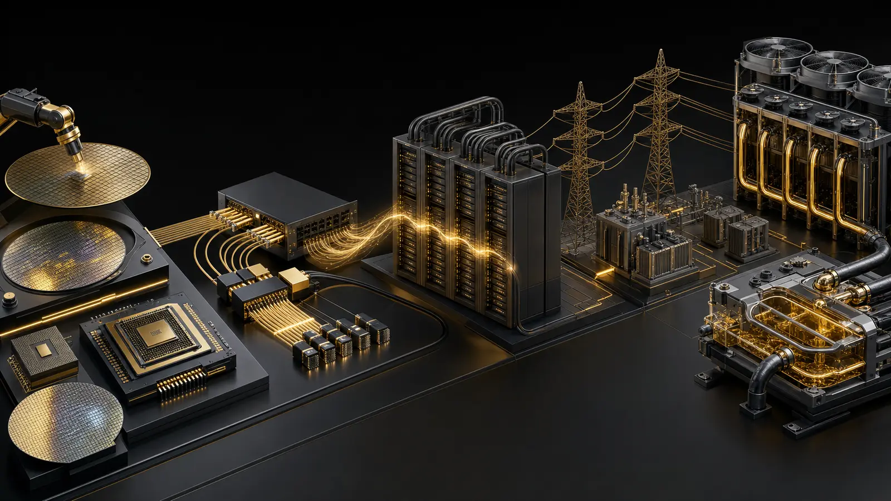

{.hero width=100% fig-alt="웨이퍼에서 데이터센터와 전력 냉각으로 이어지는 AI 인프라 공급망"}

::: {.callout-note}
## 핵심 인사이트
AI CAPEX는 GPU 구매에서 끝나지 않는다. 전력 인입, 변압·배전, 광 연결, 냉각, 건설 일정 중 **가장 느린 고리**가 전체 컴퓨팅 가동률을 결정한다.
:::

# 자본의 다섯 단계

<div class="chain"><div><b>1. 실리콘</b><br>가속기·메모리·패키징</div><div><b>2. 연결</b><br>스위치·광트랜시버·케이블</div><div><b>3. 랙</b><br>서버·전원분배·통합</div><div><b>4. 전력</b><br>발전·송전·변압·UPS</div><div><b>5. 열</b><br>액체냉각·열교환·칠러</div></div>

Microsoft는 FY2026 Q1 설명에서 연간 AI 용량을 80% 이상 늘리고 향후 2년 데이터센터 면적을 대략 두 배로 확대하겠다고 밝혔다. Wisconsin의 Fairwater는 단일 사이트 2GW 규모로 제시됐다. [Microsoft FY2026 Q1 earnings call](https://www.microsoft.com/en-us/investor/events/fy-2026/earnings-fy-2026-q1)

Alphabet은 2025 Q4 설명에서 2025 투자액의 약 60%가 서버 등 기계에 쓰였고 2026년에도 유사한 구성을 예상한다고 설명했다. 이는 CAPEX가 건물만이 아니라 가속기와 네트워크 장비에 직접 전이됨을 보여준다. [Alphabet 2025 Q4 earnings call](https://abc.xyz/investor/events/event-details/2026/2025-Q4-Earnings-Call-2026-Dr_C033hS6/default.aspx)

# 병목은 이동한다

```{=html}
<svg viewBox="0 0 760 330" role="img" aria-label="AI 데이터센터 병목 민감도 개념도" style="width:100%;background:#fff;border-radius:14px"><g font-family="system-ui,sans-serif"><text x="22" y="32" font-size="19" font-weight="700" fill="#5b4316">가동 지연에 대한 병목 민감도 — 분석 프레임</text><g font-size="13"><text x="22" y="82">전력 인입·변압</text><rect x="170" y="64" width="490" height="25" rx="6" fill="#b27b22"/><text x="675" y="82">매우 높음</text><text x="22" y="132">냉각 통합</text><rect x="170" y="114" width="420" height="25" rx="6" fill="#c69540"/><text x="605" y="132">높음</text><text x="22" y="182">광 네트워크</text><rect x="170" y="164" width="385" height="25" rx="6" fill="#d2ab64"/><text x="570" y="182">높음</text><text x="22" y="232">랙 통합</text><rect x="170" y="214" width="315" height="25" rx="6" fill="#ddc18b"/><text x="500" y="232">중간</text><text x="22" y="282">토지·건물</text><rect x="170" y="264" width="280" height="25" rx="6" fill="#e6d2ab"/><text x="465" y="282">중간</text></g><text x="22" y="316" font-size="11" fill="#6b7280">정량 시장점유율이 아닌 공급망 리드타임을 비교하는 분석 프레임</text></g></svg>
```

Microsoft Research의 데이터센터 수명주기 연구는 GPU뿐 아니라 switchgear, transformer, UPS, PDU, busbar, rack distribution을 별도 자원으로 다룬다. 장비 하나가 늦으면 설치된 GPU도 수익을 만들지 못한다. [Rearchitecting the Datacenter Lifecycle for AI](https://www.microsoft.com/en-us/research/wp-content/uploads/2026/03/AI-DC-Lifecycle-Compass.pdf)

# FDE가 볼 질문

- **수요**: 클라우드 예약·백로그가 실제 가동으로 전환되는가?
- **공급**: 칩이 아니라 전력 승인과 변압기 리드타임이 지연시키는가?
- **효율**: 같은 MW에서 추론량과 매출이 얼마나 늘어나는가?
- **회수**: 감가상각·전력비·유휴율을 포함해 투자수익을 설명할 수 있는가?
- **보안**: 운영 데이터와 모델 데이터의 경계를 설계했는가?

# 투자 해석의 함정

CAPEX 증가는 공급망 매출 기회인 동시에 클라우드 사업자의 감가상각·마진 압력이다. 주문 증가만 보고 수익성을 단정해서도, GPU 출하만 보고 데이터센터가 즉시 가동된다고 가정해서도 안 된다. 이 글은 공급망 분석 프레임이며 투자 권유가 아니다.
