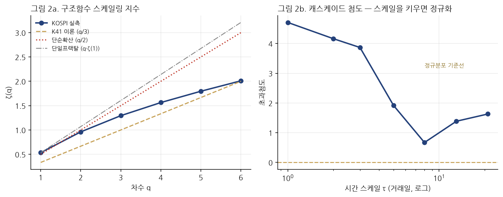
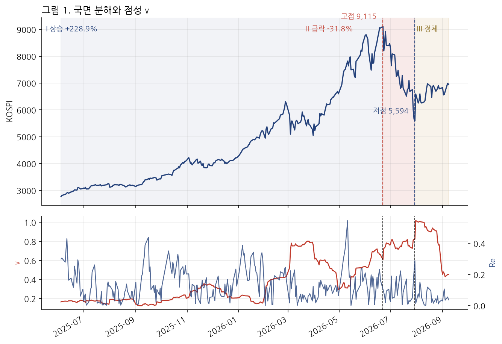

::: {.callout-warning}
## 먼저 읽을 것: 이 글은 하나의 전제 위에 서 있다

이 글은 **"AI 혁명이 증기기관 산업혁명 이상의 사회경제 변화를 일으킨다"**는 전제를 채택하고, 그 전제가 참일 때 시장 데이터가 무엇을 보여야 하는지를 따진다. 전제 자체를 증명하지 않는다.

실측 부분은 다르다. 2025년 6월 4일부터 2026년 9월 9일까지 KOSPI와 섹터 ETF 10종, 원/달러를 대상으로 계산했고, **확립된 결과와 반증된 결과를 모두 적었다.** 표본은 310거래일이며 급락·정체 국면은 각 27~28일에 불과하다. 고차 통계량의 검정력이 낮다.

여기의 어떤 결과도 매매에 적용하지 않았다.
:::

# 질문을 바꾸면 답이 달라진다

AI가 증기기관보다 큰 변화를 일으킬 것인가 — 이 질문은 검증하기 어렵다. 100년이 필요하다.

대신 이렇게 물으면 지금 답할 수 있다. **전제가 참이라면, 2026년의 시장 데이터는 어떤 모양이어야 하는가.** 그리고 실제 데이터는 그 모양인가.

이 글의 결론을 먼저 적는다. 두 혁명의 결정적 차이는 크기가 아니라 **충격이 통과하는 매질의 점성**이다. 그리고 그 차이는 측정된다.

---

# 1. 첫 번째 비대칭 — 증기기관은 이론을 낳게 했고, AI는 이론을 낳는다

증기기관과 열역학의 순서를 기억할 필요가 있다.

와트의 기관은 1769년에 특허를 받았다. 카르노가 『불의 동력에 관한 고찰』을 낸 것은 **1824년**이고, 열역학 제2법칙이 클라우지우스와 켈빈에 의해 정식화된 것은 **1850년대**다. 기계가 먼저 돌았고, 이론은 그 기계를 연구한 결과로 **반세기 뒤에** 나왔다.

2026년 9월에 벌어진 일은 순서가 반대다.

Levent Alpöge와 Tristan Buckmaster는 비점성 Boussinesq 방정식의 유한시간 폭발을 증명한 논문에서 `AI statement`라는 절을 본문에 두고 이렇게 적었다.

> Claude와 Codex를 모두 사용해 증명을 반복 개선했다. Claude를 써서 **2026년 8월 15일**에 첫 폭발 해를 얻었고, **8월 22일**에 Lean으로 검증했다. Claude와 반복해서 만든 첫 원고는, 우리 생각에, 수학 역사상 우리가 본 가장 나쁜 원고였다.

일주일이다. 착상에서 기계검증까지 일주일이 걸렸다. 그리고 이들이 다룬 것은 나비에–스토크스 방정식 — **유체역학 그 자체**다.

여기에 이 글의 첫 번째 명제가 있다.

::: {.callout-note}
## 명제 1
증기기관은 그것을 설명할 이론(열역학)을 **50년 뒤에** 낳게 했다. AI는 그것이 서 있는 학문(수학)을 **동시에** 생산하고 있다. 도구가 자기 자신의 이론적 기반을 만드는 것은 산업사에 선례가 없다.
:::

다만 정직하게 덧붙인다. 저자들이 증명한 것은 **강제항이 있는 비점성** 방정식이며, 밀레니엄 문제인 3차원 나비에–스토크스 전역 정칙성은 **여전히 미해결**이다. 같은 주에 OpenAI가 해결을 주장했으나 증명도 Lean 파일도 공개되지 않았다. 그리고 저자들은 최종 원고를 읽을 만하게 만든 것이 사람의 몫이었다고 명시했다.

---

# 2. 두 번째 비대칭 — 매질의 점성

기술 충격의 크기가 같아도, 그것이 통과하는 매질이 다르면 결과의 **모양**이 달라진다.

증기기관의 충격은 고점성 매질을 통과했다. 물리적 자본은 옮기는 데 몇 년이 걸렸고, 노동은 지리에 묶여 있었으며, 정보는 우편의 속도로 움직였다. 점성이 높은 유체에서 충격은 **층류로 천천히 확산**한다. 로버트 앨런이 '엥겔스의 휴지기'라 부른 현상 — 1790년대부터 1840년대까지 실질임금이 정체한 반세기 — 이 그 확산 지연의 이름이다.

AI의 충격이 먼저 통과하는 매질은 금융자본이다. 즉시 움직이고, 전지구적이고, 레버리지가 걸린다. **점성이 낮다.**

::: {.callout-note}
## 명제 2
같은 크기의 기술 충격이라도, 저점성 매질을 먼저 통과하면 **가격이 난류로 반응**한다. 실물은 여전히 고점성 제약(전력망, 변압기, 인허가, 숙련노동)에 걸려 있으므로, **금융 재가격과 실물 조정 사이에 간극이 벌어진다.**
:::

이 명제는 검증 가능한 예측을 낳는다. 전제가 참이라면 지금 시장에서 두 가지가 관측되어야 한다.

1. 가격 변동이 단순 확산이 아니라 **난류의 통계적 지문(다중프랙탈 간헐성)**을 보일 것
2. 승자가 아직 정해지지 않았으므로 **횡단면 분산이 높게 유지**될 것

---

# 3. 확립된 것 — 다중프랙탈 간헐성

난류 판정을 비유에서 측정으로 옮기려면 구조함수를 쓴다.

$$S_q(\tau) = \langle |\Delta_\tau \log P|^q \rangle \sim \tau^{\zeta(q)}$$

`ζ(q)`가 `q`에 선형이면 단일 스케일 과정이다. 비선형(오목)이면 다중프랙탈이며, 이는 난류 속도 증분의 표준적 성질인 간헐성을 뜻한다.

| 구간 | q=1 | q=2 | q=3 | q=4 | q=5 | q=6 |
|---|---:|---:|---:|---:|---:|---:|
| KOSPI 실측 | 0.535 | 0.961 | 1.294 | 1.564 | 1.796 | **2.010** |
| Kolmogorov 1941 (q/3) | 0.333 | 0.667 | 1.000 | 1.333 | 1.667 | 2.000 |
| 단순확산 (q/2) | 0.500 | 1.000 | 1.500 | 2.000 | 2.500 | 3.000 |

선형이라면 `ζ(6)`은 `6ζ(1) = 3.21`이어야 한다. 실측은 **2.010**이다.

간헐성 지표 `ζ(6) − 6ζ(1) = −1.397`이고, 블록 부트스트랩 2000회의 95% 신뢰구간은 **[−1.991, −0.551]**로 0을 배제한다. 캐스케이드 첨도도 τ=1일 4.71에서 τ=8일 0.67로 감소해, 스케일을 키우면 정규분포에 수렴한다.

**KOSPI는 통계적 의미에서 난류다.** 명제 2의 첫 번째 예측이 지지된다.

## 두 번째 예측 — 횡단면 분산

섹터 ETF 10종의 일간 수익률 횡단면 표준편차를 `|∇θ|`로 정의했다.

| 국면 | 기간 | n | `\|∇θ\|` 평균 |
|---|---|---:|---:|
| I 상승 (+228.9%) | 2025-06 ~ 2026-06 | 256 | 1.600% |
| II 급락 (−38.6%) | 2026-06-22 ~ 07-30 | 27 | 3.074% |
| III 정체 | 2026-07-30 ~ 09-09 | 28 | **2.618%** |

상승기 대비 정체기의 분산이 크다는 단측 검정에서 **p < 0.00001**이다. 본 분석 전체에서 국면 간 차이가 결정적으로 유의하게 나온 지표는 이것이 유일하다.

지수는 멈췄는데 업종 간 격차는 상승기의 1.6배로 벌어져 있다. **시장이 아직 승자를 정하지 못했다.** 명제 2의 두 번째 예측도 지지된다.

---

# 4. 반증된 것 — 그리고 그것이 논지를 강화하는 이유

정직하게 적는다. 유체 유추를 밀고 나간 다른 두 시도는 실패했다.

**레이놀즈 수는 거꾸로 갔다.** `Re = |u|/ν`로 계산하면 국면이 진행될수록 감소한다: 0.143 → 0.098 → 0.052. 점성 `ν`가 유속보다 빠르게 커지기 때문이다. 유체역학에서 낮은 레이놀즈 수는 점성지배, 즉 **층류**를 뜻한다. 공식을 그대로 쓰면 폭락 구간이 층류로 분류된다.

**유체량은 선행지표가 아니었다.** 점성의 정점은 가격 고점보다 **28거래일**, 횡단면 기울기의 정점은 **34거래일** 늦다. 조기경보로 쓸 수 없다.

그런데 첫 번째 실패는 다시 읽으면 논지를 오히려 강화한다.

::: {.callout-note}
## 명제 3 — 점성의 비대칭 전환
AI 자본의 저점성은 **상승 국면에서만** 작동한다. 충격이 오면 점성이 0.331에서 0.786으로 2.4배 급증하며 매질이 급격히 **고점성으로 전환**한다. 증기기관 시대의 물리자본에는 이 전환이 없었다 — 항상 고점성이었다. 저점성과 고점성을 오가는 매질은 AI 시대의 새로운 성질이다.
:::

폭락은 소용돌이가 커진 사건이 아니라 **유체가 걸쭉해진 사건**이었다. 흩어져 도는 것이 아니라 굳어서 흐르지 않았다. 2026년 7월 28일 −10.8%, 29일 −6.0%, 그리고 31일 +17.9%. 유동성이 사라진 시장의 모습이다.

---

# 5. 세 번째 비대칭 — 한국은 영국이 아니다

증기기관 혁명의 중심국 영국은 기축통화국이었다. AI 혁명의 공급망 중심에 있는 한국은 아니다. 이 차이는 측정된다.

원화 자산과 달러 자산을 두 유역으로 놓고 경계면을 환율로 두면, 외국인이 겪는 손익은 두 수두의 합으로 분해된다.

$$r_{USD} = r_{KOSPI} - r_{FX}$$

| 국면 | 원화기준 | 환율기여 | 달러기준 |
|---|---:|---:|---:|
| I 상승 | +237.7% | **−9.8%** | +204.8% |
| II 급락 | −38.6% | +6.2% | −34.8% |
| III 정체 | +24.3% | +7.3% | +33.5% |

그리고 결합계수가 문제다.

| 국면 | corr(주가, 환율) | p |
|---|---:|---:|
| I 상승 | −0.401 | <0.0001 |
| II 급락 | −0.333 | 0.097 |
| III 정체 | **−0.534** | 0.005 |

**세 국면 모두 음수다.** 주가가 내리는 날 원화가 약해진다. 외국인에게는 두 수두가 동시에 빠진다. 통화가 자연 헤지로 작동하지 않는다. 그리고 결합은 **정체 국면에서 가장 강하다.** 위기가 지났는데 경계면은 오히려 조여지고 있다.

흥미로운 것은 점성이다. 주가 점성이 2.4배 폭증하는 동안 **환율 점성은 0.097에서 0.100으로 사실상 불변**이었다. 경계면은 충격의 **부호는 전달했으나 크기는 전달하지 않았다.**

::: {.callout-note}
## 명제 4
AI 혁명의 수혜가 아무리 커도, 비기축통화국에서는 그 수혜가 **환율 채널을 통해 부분적으로 반납**된다. 상승기 −9.8%p가 그 크기다. 증기기관 시대의 영국에는 없던 세금이다.
:::

---

# 6. 엥겔스의 휴지기는 어디에 나타나는가

산업혁명에서 생산성 증가가 실질임금으로 옮겨가는 데 반세기가 걸렸다. AI에서 그 지연은 어디에 나타날 것인가.

이 글의 답은 **횡단면 분산**이다.

기술 충격이 확실하다면 승자도 확실해야 하고, 그렇다면 분산은 좁아져야 한다. 그런데 정체 국면의 `|∇θ|`는 2.618%로 상승기의 1.6배다. 시장은 AI 수요를 의심하지 않으면서도 **누가 그 이익을 가져갈지는 결정하지 못하고 있다.**

실제로 저점 이후 섹터 수익률의 선두는 반도체가 아니었다.

에너지화학 +22.2%, 2차전지 +21.0%, 헬스케어 +17.1%, IT +12.8%, **반도체 +12.2%(10개 중 5위)**.

관측 창을 최근 20거래일로 좁히면 반도체 +18.8%로 1위가 된다. **주도 업종이 창 길이에 따라 뒤집힌다는 것 자체가 분산의 증거다.**

---

# 7. 이 논지가 틀렸다면 무엇이 관측되어야 하는가

반증 조건을 적어 둔다. 없으면 이 글은 서사에 불과하다.

| 관측 | 논지에 대한 함의 |
|---|---|
| 간헐성이 사라지고 `ζ(q)`가 선형에 수렴 | 명제 2 기각 — 금융 매질이 난류가 아니었다 |
| 횡단면 분산이 상승기 수준(1.6%)으로 회귀 | 명제 2의 두 번째 예측 기각 — 승자가 결정됐다 |
| 충격기에 점성이 오르지 않음 | 명제 3 기각 — 매질 전환이 없다 |
| corr(주가, 환율)이 양으로 전환 | 명제 4 기각 — 통화가 헤지로 작동한다 |
| 강제항 없는 나비에–스토크스 폭발이 사람 손으로 먼저 증명됨 | 명제 1 약화 — AI가 이론 생산의 주역이 아니다 |

가장 빨리 갈릴 것은 두 번째다. 분산은 매일 계산되고, 30일이면 방향이 보인다.

---

# 8. 결론

AI 혁명이 증기기관보다 크다는 전제를 받아들이면, 시장 데이터는 그 전제와 **정합적이다.** 다만 정합의 방식이 직관과 다르다.

크기가 같은 충격이라도 저점성 매질을 먼저 통과하면 가격은 **난류로** 반응한다. 실측된 다중프랙탈 간헐성 `ζ(6) − 6ζ(1) = −1.397`, 95% 신뢰구간 `[−1.991, −0.551]`이 그 지문이다. 그리고 실물이 아직 따라오지 못했으므로 **횡단면 분산이 상승기의 1.6배로 유지된다**(p < 0.00001).

동시에 두 가지 유혹을 기각해야 한다. 레이놀즈 수는 폭락을 층류로 분류하며 유추는 그 층위에서 무너진다. 유체량은 가격 고점보다 한 달 늦게 정점에 도달하므로 조기경보가 될 수 없다.

증기기관은 자기를 설명할 이론을 반세기 뒤에 낳게 했다. AI는 그 이론을 지금 만들고 있으며, 그 사실 자체가 이번 혁명의 속도를 말해 준다. 다만 속도가 방향을 뜻하지는 않는다. **빠른 매질은 빨리 오르고 빨리 굳는다.**

::: {.callout-important}
## 한계

표본이 하나다. 급락과 정체가 각 27~28거래일이며 고차 모멘트 추정에 부족하다. +228.9% 상승은 일반적 국면이 아니어서 외적 타당도가 제한된다. 정책·글로벌 경기·반도체 사이클을 분리하지 못한다. 명제 1~4는 **가설이며 검정된 명제가 아니다.** 검정된 것은 3절의 두 결과와 5절의 결합계수뿐이다.
:::

---

**분석 코드** `waterfirst/ns-capital-flow` · `analysis/` (구조함수·부트스트랩·통화채널 전 과정 재현 가능)

**참고**

- Terence Tao, *Finite time blowup with smooth forcing term...* (2026-09-07) — <https://terrytao.wordpress.com/2026/09/07/finite-time-blowup-with-smooth-forcing-term-for-the-incompressible-porous-medium-boussinesq-and-incompressible-euler-equations/>
- L. Alpöge, T. Buckmaster, *Blowup for the Boussinesq equations with smooth forcing* — <https://cims.nyu.edu/~tristanb/boussinesq.pdf>
- D. Córdoba, L. Martínez-Zoroa — <https://arxiv.org/abs/2410.22920v3>
- S. Ghashghaie et al., *Turbulent cascades in foreign exchange markets*, Nature 381 (1996)
- R. C. Allen, *Engels' pause: Technical change, capital accumulation, and inequality in the British industrial revolution* (2009)
- Nature News (2026-09-08) — <https://www.nature.com/articles/d41586-026-02842-5>
